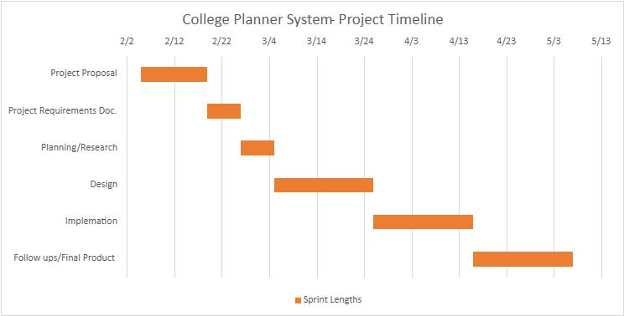
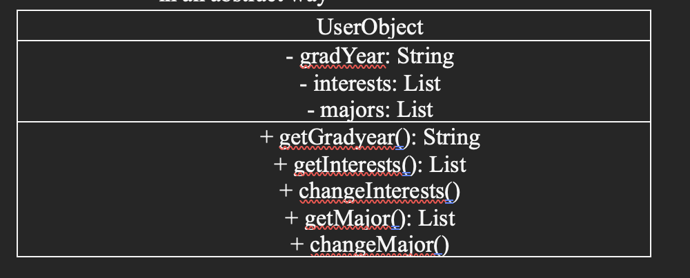
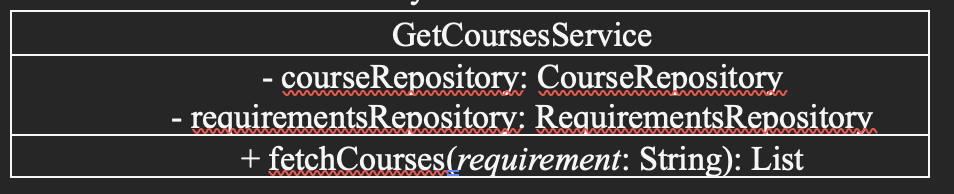
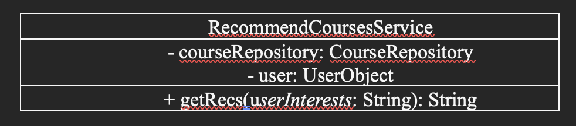
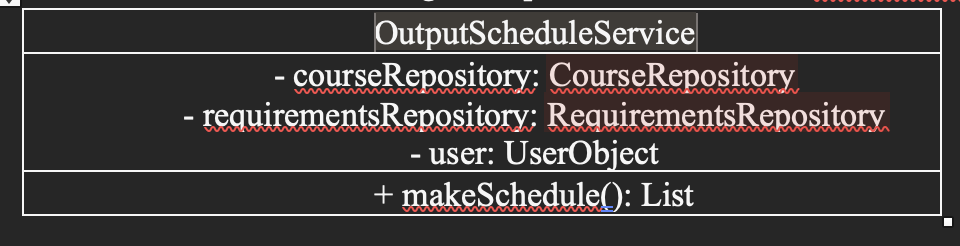
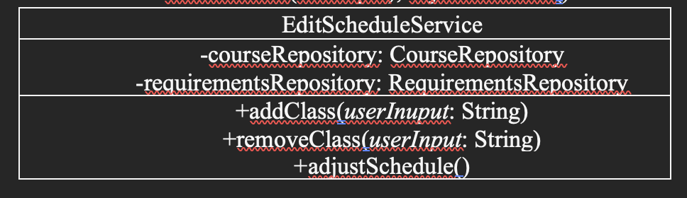
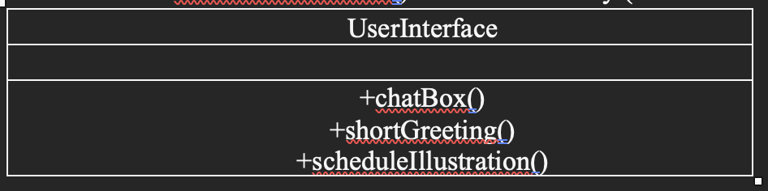
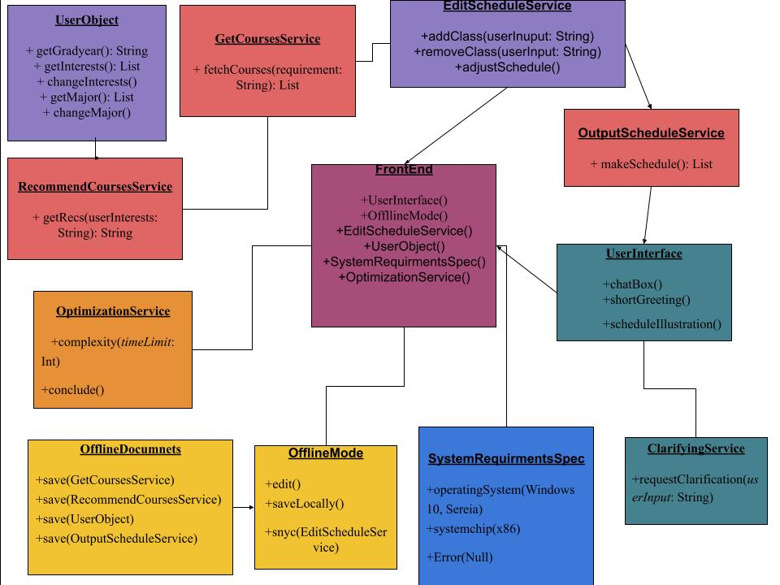

# Alex Hickman, Claire Shoemaker, & Luke Jeffries Professor Ralph Rostock CS 375-A
<a href="https://cshoe7.github.io/course_scheduler/CS_code/UI/index.html">AI Agent Chat</a>
# Project Proposal — Ursinus Course Planner

## Description 

Over the course of the semester, we are going to build a project that helps students to plan their classes during their time at Ursinus. The user will provide their majors/minors, their interests outside of their fields of study, and which courses they’ve already taken, and the app will output a potential schedule spanning 2 semesters. This schedule will include their major requirements, as well as their general requirements which will be selected using the other interests inputted. The app will make use of the Ursinus Course catalog and the Quest Curriculum requirements to accurately compile a schedule. It will involve sorting through a large amount of data, as well as organizing that data into traversable data structures so that the information can be easily extracted.  

## Compelling Need 

Registering for classes is a cumbersome, time-consuming process. It involves identifying which major courses a student must take, as well as understanding which general education courses are required. Attempting to comb through the lengthy course catalog to find which courses meet what requirements, when each of the courses are offered, and deciding if the student is interested can take a long time. Our solution will aim to make this process easier for the students, allowing them to easily see which classes they can take and when they can take them. Faculty members at Ursinus who serve as advisors can also take advantage of this software to help their advisees schedule their courses.  

## Stakeholder Groups 

Students and advisors at Ursinus College would be able to put our software to use to aid course selection and alleviate stress. We plan to regularly update our stakeholders, such as professors who serve as advisors through emails and possible meetings. We’ll take into account any feedback they have regarding our solutions functionality.  

## Technical Expertise 

We have proficiency in programming languages such as python and C++languages, however we will need to learn how to utilize git and github to better communicate and collaborate our work on this project. 

## Minimum Viable Project Scope 

We would need to at least have functionality in place that takes in the student's major, minor and other interests, searches through the course catalog to find the relevant courses and then outputs the student schedule for 2 semesters. At first, we will limit our project to planning Computer Science, Mathematics, and Statistics majors’ schedules. The resulting schedule would need to reflect Ursinus College’s graduation requirements and would consider when each course is offered.  We will use a pdf processing library to convert the information into a text file, then attempt to traverse that text and extract the relevant course information. We would then put that information into a dictionary, which will be more easily traversed when looking for specific courses. We’re starting with only the Computer Science department to assess the feasibility of doing this with the entire catalog.  

## Aspirant Scope 

Time allowing, we would like to incorporate more AI elements into the project. The AI agent would automate the process of searching through the course catalog. It would zero in on the sections relevant to the students' interests and then would use that information to compile a schedule for them. We could also add a chat feature where the student could ask questions about the classes or make changed to the current schedule. We are also striving to increase the capabilities of the software to plan out a full college career of 8 semesters. Another feature that we would ideally incorporate would be broadening the scope of the project to all majors offered at Ursinus. Being able to generalize this software to other universities’ courses would allow us to bring this product to more users though it may prove unrealistic in the allotted time. 

## Timeline 

The timeline of our Project will stretch until the end of the semester. We will have 1-week sprints where we can rally together and share ideas as well as review work done during the previous week. We will split the role of document lead between the three of us as we do not have enough members for each person to only have one role. Every 3 weeks we will rotate responsibilities in such that Project Lead -> Scrum Lead -> Code Lead -> Project Lead. Alex will start the semester as the Project Lead. Claire will start the semester as the Scrum Lead. Luke will start the semester as the Code Lead. 

## Intellectual Merit 

Ursinus doesn’t have a scheduling tool of this nature, so this has the potential to make the whole scheduling process more efficient for advisors and students. It’s worth making this tool to ease the stress and burden of planning courses through your college career and add convenience to the process. 

## Broader Impacts 

Students and advisors at Ursinus would benefit. If the project grows beyond the scope of Ursinus, then other students at other colleges could benefit as well. 

# Requirements Report

## Stake holder questions, input, and reflections
### What is your experience finding/scheduling classes at Ursinus?
_Stakeholder:_
-	Okay, major related classes are fine, other core requirements are harder
-	Course catalog is difficult to use

_Reflections:_ 
We should put a focus on the other general education requirements. It would be ideal if you could ask for a list of courses offered during a certain semester that fill a certain requirement. We should also make sure it’s easy to use, with good UI and structure.

### What would make this process easier?
_Stakeholder:_
-	A search function, if you could type in broad words that would be related to the course
o	If you were able to search something like painting because you’re interested in painting, then got recommended art.
-	She wishes there was a connection between my progress tab and course catalog, like a list of the classes that fulfill that requirement under each tab in my progress.
-	Making recommendations for certain credit requirements based on your major/minor
-	Being able to see where each course fits into your schedule (calendar function)
-	Professor ratings within the catalog?

_Reflections:_  
She essentially wanted a more user-friendly course catalog. We can have the AI agent only fill the schedule with courses the user is interested in. We can also make it do something like the painting example. You could prompt it with: “I like to paint, what course should I take?” and it can recommend courses. For the calendar point, we would have to make the output easy to read.

### I explained our idea and asked her what she thought.
_Stakeholder:_
-	 Timing would be hard; knowing when courses are offered each semester
- What if it assigns you two classes that are offered at the same time, we don’t know when the classes are offered yet
-	How do we consider classes already taken?

_Reflections:_  
At the very least, which semesters the courses are offered (i.e spring of even years) can usually be found in the course description, so that part at lease can be accurate. We don’t have access to course times, so that introduces the potential to unknowingly schedule two conflicting courses. I think the aim of the solution is to give students a rough outline of the courses they could take throughout their time at Ursinus, so times wouldn’t necessarily be required for that. For classes already taken, the use could be prompted to input previous classes if they’re relevant to the schedule. They could also be address in clarifying questions or changes made to the schedule after its generated. If the agent schedules classes the user has already taken, the user can point those out and change them. If something like that comes up initially, then the agent should ask the user clarifying questions to better understand what the user wants.

## Requirements and User Stories
### Functional Requirements
1)	When prompted, list courses that fulfill a certain requirement.
- As a student, I need to be able to get a list of courses that fulfil a certain requirement because I want to see what course options I have.
2)	When prompted, recommend courses to the student based on their interests.
- As a student, I need accurate course recommendations based on my interests because I want to take courses I’m interested in.
3)	When prompted, output a 2-semester schedule for an Ursinus student based on their inputted major, minor, interests, and previously taken courses.
- As a student, I need the app to output my schedule for two semesters based on my major and interests because searching through the course catalog is difficult.
4)	The outputted schedule will accurately reflect the information in the course catalog; there will be no hallucinations.
- As a student, I need the outputted schedule to accurately depict a schedule for my current year at Ursinus because I don’t want scheduling mistakes in my schedule.
5)	If user input is unclear, ask the user clarifying questions. 
- As a student, I need the app to ask clarifying questions if something is unclear because I don’t want it to make assumptions about what I want.
6)	When prompted, allow the user to make changes to the outputted schedule.
- As a student, I need to be able to make changes to my schedule after the initial output because I might want to explore other course options.
7)	Runtime will be less than 20 seconds.
- As a student, I need the runtime to be less than 20 seconds because I don’t want to wait a long time for my schedule
8)	The app will be easy to navigate and use.
- As a student, I need the UI and structure to be easily understood because I don’t want to get confused when using the app.

### Nonfunctional Requirements
1)	When running locally, the solution will run without internet
2)	When running locally, user will download a requirements file with the necessary libraries
3)	The user will need to have Mac M series chips, or any x86 chips
4)	The user will need to have Windows 10 or higher with latest drivers for windows installed

## Press Release
Registering for classes at Ursinus is, unfortunately, a cumbersome, time-consuming process. Attempting to comb through the lengthy course catalog to find which courses meet what requirements, what classes are mandatory, and separating the classes into ones that interest a person can take a long time. Why must hundreds of students endure this arduous process every time course selection rolls around for the next semester? We aim to make this process easier for students and faculty advisors alike. Our software will allow them to easily see which classes they can take and what the reasons are for taking the course. Just a glance at the results of our software will allow a person to understand what would have required a borderline degree in the course catalogue to decipher previously. No longer will students have to pour over hundreds of pages and clunky interfaces to simply find the classes they want to take. Faculty members at Ursinus who serve as advisors can also take advantage of this software to help their advisees schedule their courses. Course selection is often a source of stress and extreme busyness, but this can be avoided by supplying sorely needed quality of life improvements. We want to ease the burden of students who already have a lot going on and are, metaphorically, balancing numerous plates at once. Our software will increase the efficiency of deciding on the courses a student takes in the coming semesters to add convenience back into the process of scheduling. Our product is a customized AI agent tailor-made to serve Ursinus students in the process of course selection. The AI agent automates the process of searching through the course catalog that would take multiple days for a student to read fully. All the AI agent needs from the student are a few pieces of information such as the student’s major, any academic interests inside or outside of their field of study, and which courses the student has already taken. With these basic pieces of information, the AI agent will be able to personally customize a schedule made for the student. The student can inquire about why the AI agent picked certain classes, ask any other questions they have on their mind, or make certain suggestions or requests for alternative courses not listed on the potential mock schedule. Our project will break down what was once a daunting process into very manageable steps through the power and capabilities of our new product that fills a noticeably missing niche as a scheduling tool.

## FAQ:
### What is the product?
An AI-powered agent that automates the creation and optimization of course schedules at Ursinus
### Who is this tool designed for?
Current Ursinus students, faculty members, advisors, and department heads
### Does this system automatically register for classes?
No, the student themselves still has to actually sign up for their courses while the product indicates courses they would benefit from taking.
### Is there customizability?
Yes, the AI agent can recalculate the schedule for alternative courses or unique specifications from student to student.
### What input from the user is required?
The AI agent only needs your major, interests, and previous courses taken at Ursinus

## Gantt chart
Here is the timeline outlining our planned start and end dates for the College Planner development process.

# Design Report

## Summary of Project Goals and Requirements
Our project will create a course scheduler powered by an AI agent for Ursinus students that will output a 2-semester schedule (or 1 academic year) based on user input of their major, minor, interests, and previously taken courses. The outputted schedule will include specific courses offered at Ursinus that need to be taken to fulfill the various requirements for graduation. If the outputted schedule is not to the user’s liking, they are able to prompt the AI agent for refinements and changes to explore alternatives or make alterations to their proposed schedule. If the user’s instructions are unclear, the AI agent will ask clarifying questions to ensure an appropriate schedule. The proposed schedule will be appropriate and realizable for a student at Ursinus (i.e. all courses proposed are actual courses offered at Ursinus and relevant to the user). The runtime for how long a user waits for output after user input will be less than 20 seconds. The user will be able to easily navigate a web page with minimal difficulty due to the user-friendly interface to create a schedule.

## Software Designs for Requirements

1)	Create a user profile that holds relevant information about the user.
   * Software Design: Module: UserObject: getGradYear(), getInterests(), getMajor() in an abstract way

2)	When prompted, list courses that fulfill a certain requirement.
   * Software Design: Microservice: GetCoursesService: fetchCourses(requirement) in an isolated way

3)	When prompted, recommend courses to the student based on their interests.
   * Software Design: RecommendCoursesService: getRecs(userInterests) in a modular way

4)	When prompted, output a 2-semester schedule for an Ursinus student based on their inputted major, minor, interests, and previously taken courses.
   * Software Design: OutputScheduleService: makeSchedule() in a modular way

5)	If user input is unclear, ask the user clarifying questions.
   * Software Design: Microservice: ClarifyingService: requestClarification(userInput) in a modular way

6)	When prompted, allow the user to make changes to the outputted schedule.
   * Software Design: Microservice: EditScheduleService: addClass(userInuput), removeClass(userInput), adjustSchedule() in a modular way

7)	Runtime will be less than 20 seconds.
   * Software Design: OptimizationService: complexity(timeLimit), conclude() in an abstract way (depends on runtime and features of other modules)

8)	The app will be easy to navigate and use.
   * Software Design: Design Pattern: UserInterface: chatBox(), shortGreeting(), scheduleIllustration() in an abstract way (relies on other features of project)

9)	The user will need to have Mac M series chips, or any x86 chips

## Pre- and Post-Conditions
### UserObject
#### Pre-Conditions:
  * User inputs gradYear, interests, and majors
  * The user inputs have to be valid
#### Post-Conditions:
  * User object is created with all relevant info 
Fulfills requirement 1

### GetCoursesService
#### Pre-Conditions:
  * Requirement exists
  * Course and Requirement repos are correct and accessible
#### Post-Conditions:
  * List of courses fulfilling the requirement is returned 
Fulfills requirement 2

### RecommendCourseService
#### Pre-Conditions:
  * Course Repo is correct and accessible
  * User profile exists and is accessible
  * User profile is initialized with interests
#### Post-Conditions:
  *	User gets course recommendations based on interests
  *	The recommendations make sense and are relevant 
Fulfills requirement 3

### OutputScheduleService
#### Pre-Conditions:
  * Course and Requirement repos are correct and accessible
  * User profile exists and is accessible
  * User profile is initialized with interests and majors
#### Post-Conditions:
  * User gets a 2-semester schedule
  * Schedule is relevant to their major and interests
  * Schedule is filled with courses that are in the course catalog 
Fulfills requirement 4

### ClarifyingService
#### Pre-Conditions: 
  * User Input exists
  * User input are questions or instructions to create a schedule
  * Ambiguity/unspecific input that requires elaboration for creating an accurate schedule
#### Post-Conditions:
  * Clarification for instructions gained
  * Rephrased user input to actionable instructions for making a schedule 
Fulfills requirements 5

### EditScheduleService
#### Pre-Conditions:
  * User input exists
  * Output schedule exists
  * User requested to add or remove a class from the schedule
#### Post-Condition:
-	Schedule updated per user request
-	Moved other classes on schedule to account for new change
-	Indicate whether schedule still fulfills graduation requirements 
Fulfills requirements 6

### OptimizationService
#### Pre-Conditions:
  * AI Agent has been prompted
  * No output yet
#### Post-Conditions:
  * There is output
  * Wait time is less than 20 seconds for output 
Fulfills requirements 7

### UserInterface
#### Pre-Conditions:
  * User has opened the webpage
#### Post-Conditions:
  * A chat box populates on the user’s screen
  * A short greeting message is visible to the user
  * A blank schedule can be seen on the webpage 
Fulfills requirements 8

## Flow Chart

# Test Plan

## User Acceptance Tests

1. **When prompted, list courses that fulfill a certain requirement.** 
  * Steps: 
    - Open/refresh the website of the course scheduler to reset any preexisting conversations
    - Type into the text box “Please provide a list of courses that fulfill the foreign language requirement at Ursinus College” and press        enter 
  * Expected result: 
    - The AI’s response includes multiple options of courses that satisfy the foreign language requirement at Ursinus College to pick from
   
2. **When prompted, recommend courses to the student based on their interests.**
  * Steps:
    - Open/refresh the website of the course scheduler to reset any preexisting conversations
    - Type into the text box “I like video games. Please provide a list of courses that align with my interests that are offered at Ursinus       College” and press enter
  * Expected result:
    - The AI’s response includes courses that are related to video games and offered at Ursinus College

3. **When prompted, output a 2-semester schedule for an Ursinus student based on their inputted major, minor, interests, and previously taken courses.**
* Pre-conditions:
  - Acceptance Tests 1 and 2
* Steps:
  - Open/refresh the website of the course scheduler to reset any preexisting conversations
  - Type into the text box “I am a Computer Science major and Mathematics minor who likes philosophy. I have taken CS-173 Intro to Computer Science already. Please provide a 2-semester course schedule for me at Ursinus College” and press enter
* Expected result:
  - The AI returns a 2-semester schedule with courses satisfying Computer Science major and mathematics minor requirements, not including CS-173, as well as philosophy elective courses offered at Ursinus College.

4.	**The outputted schedule will accurately reflect the information in the course catalog; there will be no hallucinations.**
* Pre-conditions:
  - Acceptance Test 3
* Steps:
  - Skip to iv if performing this test directly after acceptance test 3
  - Open/refresh the website of the course scheduler to reset any preexisting conversations
  - Type into the text box “I am a Computer Science major and Mathematics minor who likes philosophy. I have taken CS-173 Intro to Computer Science already. Please provide a 2-semester course schedule for me at Ursinus College” and press enter
iv.	Open the Ursinus course catalog (UrsinusCourseCatalog2025) and check that every course listed in the schedule is an actual course offered by Ursinus College.
* Expected result:
  - The AI returns a valid 2-semester schedule with courses actually offered at Ursinus College.
  
5.	**If user input is unclear, ask the user clarifying questions.**
* Steps:
  - Open/refresh the website of the course scheduler to reset any preexisting conversations
 - Type into the text box “Give me a schedule” and press enter
* Expected result:
  - The AI requests clarification and more details including potential majors, minors, interests, and courses already taken.
  
6.	**When prompted, allow the user to make changes to the outputted schedule.**
* Pre-conditions:
  - Acceptance Test 3
* Steps:
  - Skip to iv if performing this test directly after acceptance test 3 or 4
  - Open/refresh the website of the course scheduler to reset any preexisting conversations
  - Type into the text box “I am a Computer Science major and Mathematics minor who likes philosophy. I have taken CS-173 Intro to Computer Science already. Please provide a 2-semester course schedule for me at Ursinus College”
  - After receiving a response with a schedule, type into the text box “I would like to take PSYC-100 Intro Psychology. Please remove the philosophy elective course in the first semester and replace it with PSYC-100 Intro Psychology” and press enter
* Expected result:
  - The AI returns a modified 2-semester schedule with the newly specified course added and removed the philosophy elective course from the first semester.
  
7.	**Runtime will be less than 20 seconds.**
* Pre-conditions:
  - Acceptance Test 3
* Steps:
  - Open/refresh the website of the course scheduler to reset any preexisting conversations
  - Type into the text box “I am a Computer Science major and Mathematics minor who likes philosophy. I have taken CS-173 Intro to Computer Science already. Please provide a 2-semester course schedule for me at Ursinus College”
  - Prepare a timer
  - Press enter to send your prompt message
  - Start the timer
* Expected result:
  - The AI’s response should take less than 20 seconds.

8. **The website will be easy to navigate and use.**
* Steps:
  - Open/refresh the website of the course scheduler to reset any preexisting conversations
  - Type into the text box “I am a Computer Science major and Mathematics minor who likes philosophy. I have taken CS-173 Intro to Computer Science already. Please provide a 2-semester course schedule for me at Ursinus College”
  - Read the outputted schedule from the AI
  - Save the schedule locally to your machine
* Expected result:
  - There was minimal difficulty navigating the website and using its various features.

 ## Unit Tests

 ### see the file tests.py in the repo

 ## Integration Tests

 ### We didn’t use any external databases or anything like that, so we didn’t do any Integration Tests. We had external APIs we mocked in the Unit Tests.

